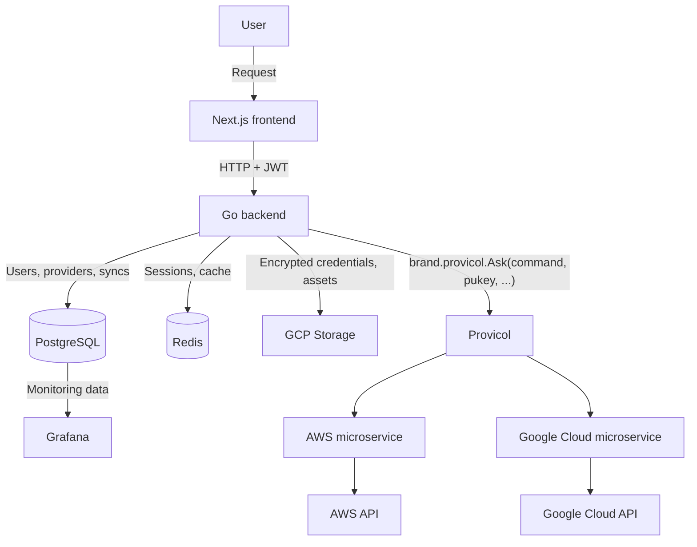

Merops follows a client-server architecture made of a Next.js frontend, a central Go backend, PostgreSQL, Redis, Google Cloud Storage, and one isolated microservice per cloud provider.

## Components

| Component | Responsibility |
| --- | --- |
| **Next.js frontend** | User interface. Sends requests to the backend and never calls cloud provider APIs directly. |
| **Go backend** | Central entry point. Handles authentication, business logic, and orchestration of provider operations. |
| **PostgreSQL** | Persistent data: users, connected providers, object metadata, synchronizations, logs, and reports. |
| **Redis** | Session storage and caching. |
| **GCP Storage** | Merops-owned resources, such as encrypted credential files and profile pictures. |
| **Provicol** | Communication protocol between the backend and provider microservices, over Unix sockets. |
| **Provider microservices** | One container per provider brand. Resolves credentials and calls the provider API. |
| **Grafana** | Monitoring dashboards built on PostgreSQL data. |

## Request flow

A typical provider operation, such as listing the buckets of a connected account, follows these steps:

1. The user performs an action in the frontend.
2. The frontend sends an authenticated HTTP request to the Go backend.
3. The backend identifies the user and the target provider.
4. The backend reads the provider key (`pukey`) and the provider brand from PostgreSQL.
5. The backend sends the command to the right microservice through Provicol.
6. The microservice resolves the credentials linked to the `pukey` and calls the cloud provider API.
7. The response travels back through Provicol to the backend, which processes it and returns the result to the frontend.

## Design principles

<CardGroup cols={2}>
  <Card title="Provider independence" icon="puzzle-piece">
    Provider-specific logic lives outside the core backend. Adding a provider means adding a microservice, not changing the backend.
  </Card>
  <Card title="Service isolation" icon="box">
    Each provider runs in its own container. A failing integration cannot crash the core application.
  </Card>
  <Card title="Centralized backend" icon="server">
    The frontend talks to a single API. Database access, authentication, and orchestration stay on the server side.
  </Card>
  <Card title="Credentials stay server-side" icon="lock">
    Credentials are encrypted per user and never sent back to the client. See the [Privacy Policy](/legal/privacy_policy#5-how-your-cloud-credentials-are-protected).
  </Card>
</CardGroup>
