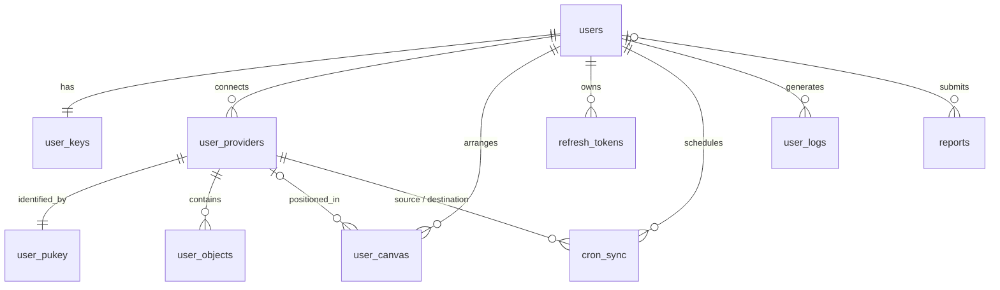

Merops stores its persistent data in **PostgreSQL**. The schema is defined in `backend/database/setup.sql` and applied when the database container is first initialized.

## Entity relationship diagram



All foreign keys to `users` and `user_providers` use `ON DELETE CASCADE`: deleting an account removes all its data. Reports are kept with `ON DELETE SET NULL` to preserve feedback history.

## Users and security

### `users`

Registered accounts.

| Column | Type | Notes |
| --- | --- | --- |
| `id` | `SERIAL` | Primary key |
| `username` | `TEXT` | Email address, unique |
| `password_hashed` | `TEXT` | Argon2 hash, never the plain password |
| `firstname`, `lastname` | `VARCHAR(100)` | Optional profile fields |
| `description` | `TEXT` | Optional profile description |
| `role` | `role` | `admin`, `betatester`, or `user` |
| `pp` | `VARCHAR(255)` | Path to the profile picture |

### `user_keys`

Cryptographic material used to protect each user's credentials.

| Column | Type | Notes |
| --- | --- | --- |
| `user_id` | `INTEGER` | Primary key, references `users` |
| `argon_time`, `argon_memory`, `argon_threads` | `INTEGER` | Argon2id parameters (defaults: `3`, `65536`, `4`) |
| `salt` | `BYTEA` | Salt for key derivation |
| `umk_wrapped`, `umk_nonce` | `BYTEA` | User master key, encrypted with a key derived from the password |

### `refresh_tokens`

Hashed refresh tokens for active sessions.

| Column | Type | Notes |
| --- | --- | --- |
| `id` | `SERIAL` | Primary key |
| `userid` | `INTEGER` | References `users`, indexed |
| `session_id` | `TEXT` | Indexed |
| `token_hashed` | `TEXT` | Unique per user |
| `created_at`, `expires_at`, `revoked_at` | `TIMESTAMPTZ` | Token lifecycle |

## Providers

### `providers`

Provider integrations available on the platform (one row per brand, such as `amazon` or `google`).

| Column | Type | Notes |
| --- | --- | --- |
| `id` | `SERIAL` | Primary key |
| `brand` | `VARCHAR(255)` | Unique brand name |
| `status` | `provider_status` | `pending`, `building`, `running`, `repairing`, `failed`, or `stopped` |
| `socketpath` | `VARCHAR(255)` | Unix socket used by Provicol |
| `container_id` | `VARCHAR(255)` | Docker container running the integration |
| `archivepath` | `VARCHAR(255)` | Source archive of the integration |

### `user_providers`

Cloud accounts connected by users.

| Column | Type | Notes |
| --- | --- | --- |
| `id` | `SERIAL` | Primary key |
| `userid` | `INTEGER` | References `users` |
| `name` | `VARCHAR(255)` | Display name chosen by the user |
| `brand` | `VARCHAR(255)` | Provider brand |
| `filepath` | `VARCHAR(255)` | Location of the encrypted credentials file |

### `user_pukey`

Maps each connected provider to the key that the provider microservice uses to resolve its credentials.

| Column | Type | Notes |
| --- | --- | --- |
| `providerid` | `INTEGER` | Primary key, references `user_providers` |
| `pukey` | `VARCHAR(255)` | Internal key, never disclosed to users |

### `user_canvas`

Positions of nodes on the [Manage](/application/dashboard/manage) canvas. A row with a `NULL` `provider_id` stores the position of the central Merops node.

| Column | Type | Notes |
| --- | --- | --- |
| `id` | `SERIAL` | Primary key |
| `userid` | `INTEGER` | References `users` |
| `provider_id` | `INTEGER` | References `user_providers`, nullable |
| `x`, `y` | `FLOAT8` | Node coordinates |

### `user_objects`

Metadata of the objects stored on connected providers.

| Column | Type | Notes |
| --- | --- | --- |
| `id` | `SERIAL` | Primary key |
| `provider` | `INTEGER` | References `user_providers` |
| `name` | `VARCHAR(1023)` | Object name, unique per provider |
| `last_edit` | `TIMESTAMPTZ` | Last modification date |
| `size` | `BIGINT` | Size in bytes |

## Synchronization

### `cron_sync`

Scheduled synchronizations between two buckets.

| Column | Type | Notes |
| --- | --- | --- |
| `id` | `SERIAL` | Primary key |
| `user_id` | `INTEGER` | References `users` |
| `from_provider`, `to_provider` | `INTEGER` | Reference `user_providers` |
| `from_bucket`, `to_bucket` | `VARCHAR(1023)` | Source and destination buckets |
| `from_path`, `to_path` | `VARCHAR(1023)` | Optional prefixes, empty by default |
| `direction` | `way_enum` | `one-way`, `two-way`, or `strict` |
| `enabled` | `BOOLEAN` | Whether the job is active |
| `running` | `BOOLEAN` | Whether the job is currently executing |
| `interval_seconds` | `INTEGER` | Run interval, `60` by default |
| `last_run` | `TIMESTAMPTZ` | Date of the last execution |
| `is_ok` | `BOOLEAN` | Result of the last execution |

## Logs and feedback

### `user_logs`

Audit trail of user actions.

| Column | Type | Notes |
| --- | --- | --- |
| `id` | `SERIAL` | Primary key |
| `userid` | `INTEGER` | References `users` |
| `action` | `log_action` | `login`, `register`, `migrate`, or `synchronize` |
| `created_at` | `TIMESTAMPTZ` | Defaults to `NOW()` |

### `reports`

Bug reports and recommendations submitted by users.

| Column | Type | Notes |
| --- | --- | --- |
| `id` | `SERIAL` | Primary key |
| `userid` | `INTEGER` | References `users`, set to `NULL` if the user is deleted |
| `environment` | `environment_type` | `beta` or `production` |
| `category` | `report_category` | `bug`, `recommendation`, or `other` |
| `description` | `TEXT` | Report content |
| `created_at` | `TIMESTAMPTZ` | Defaults to `NOW()` |

## Reset the database

In development, reset the schema with:

```bash
cd backend
make reset-db
```

<Warning>
This command deletes all existing data. Never run it against a production database.
</Warning>
